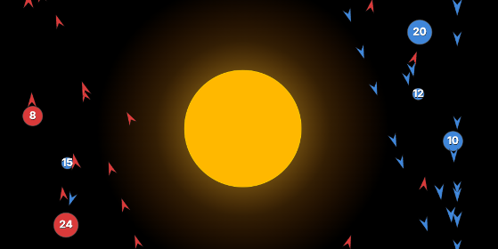

# 1. Competition Instructions And Strategy Frame

## 1. Objective



Orbit Wars is a Kaggle **two-player or four-player RTS environment** in **continuous 2D space**. Each player starts with one home planet and competes to capture neutral and enemy planets by launching fleets.

The game lasts up to **500 turns**. Final score is **total owned ships** on planets plus ships in active fleets. The highest score wins, unless elimination ends the game earlier.

Official competition URL: https://www.kaggle.com/competitions/orbit-wars

Official page description: "Conquer planets rotating around a sun in continuous 2D space. A real-time strategy game for 2 or 4 players."

Official header image source discovered from page metadata:

```text
https://kaggle.com/competitions/138420/images/header
```

Local copy:

```text
docs/assets/orbit_wars_header.png
```

Official downloadable starter files:

| File | Size | Role |
| --- | ---: | --- |
| `README.md` | `8241` bytes | Full environment rules and observation/action reference. |
| `agents.md` | `6486` bytes | Getting-started guide, local testing, CLI workflow, replay/log commands. |
| `main.py` | `2079` bytes | Nearest-planet starter agent. |

Use the official overview page plus these downloadable files as the
authoritative rule source. The rendered overview page is useful for navigation,
but the downloadable `README.md` and `agents.md` are the practical references
for implementation details, local testing, submission packaging, and replay
commands.

Latest Kaggle CLI check on 2026-06-03:

| Item | Value |
| --- | --- |
| Deadline | `2026-06-23 23:59:00` |
| Category | `Featured` |
| Reward | `50,000 Usd` |
| Team count | `3695` |
| User entered | `True` |
| Latest user submission score | `409.4` |
| Public leaderboard top score | `1785.9` |

Important correction: a third-party mirror showed a later July deadline, but the
**live Kaggle CLI** reports `2026-06-23 23:59:00`. Treat Kaggle CLI/page metadata as
authoritative.

## 2. Board And Objects

The board is a **100x100 continuous plane** with origin at the top-left. The **sun** is centered at `(50, 50)` with radius `10`. Any fleet whose path crosses the sun is destroyed.

Planets are **four-fold mirror symmetric** around the board center. Every base planet appears as `(x, y)`, `(100-x, y)`, `(x, 100-y)`, and `(100-x, 100-y)`. This symmetry makes starting positions fair and gives us a useful inference tool.

Each planet is `[id, owner, x, y, radius, ships, production]`.

| Field | Meaning | Strategic use |
| --- | --- | --- |
| `id` | Planet identifier | Action source and target bookkeeping. |
| `owner` | `-1` neutral or player id `0-3` | Classify expansion, attack, defense, reinforcement. |
| `x`, `y` | Current position | Distance, launch angle, sun collision risk. |
| `radius` | Physical collision radius | Larger planets are easier to hit and tied to production. |
| `ships` | Current garrison | Capture cost and defensive reserve. |
| `production` | Ships generated per turn when owned, from 1 to 5 | Core value signal. |

Radius is determined by production: `1 + ln(production)`.

The map contains 20 to 40 initial planets, generated as 5 to 10 symmetric
groups of 4. Home planets start with 10 ships. In two-player games, players
start on diagonally opposite home planets. In four-player games, each player
gets one planet from the selected home group.

## 3. Moving Planets And Comets

Inner planets **orbit the sun** if `orbital_radius + planet_radius < 50`. Their positions rotate by `angular_velocity` each turn. The observation includes `initial_planets` and `angular_velocity`, so we can **predict future positions** rather than aiming only at current locations.

Static planets stay fixed. At least three symmetric groups are static, and at least one group is orbiting.

Comets spawn at turns `50`, `150`, `250`, `350`, and `450`. They appear as temporary planets with production `1`, radius `1.0`, and normal capture/combat behavior. Comets leave the board; ships left on departing comets are lost. The observation includes `comets`, comet paths, path indices, and `comet_planet_ids`.

Strategic implication: **comets are not automatically worth capturing**. They can be useful as low-cost production, tempo targets, or denial targets, but their lifetime and travel geometry must beat ordinary planet expansion.

## 4. Fleet Mechanics

Each fleet is `[id, owner, x, y, angle, from_planet_id, ships]`.

**Fleet speed** scales with fleet size:

```text
speed = 1.0 + (maxSpeed - 1.0) * (log(ships) / log(1000)) ^ 1.5
```

Default `maxSpeed` is `6.0`.

Important consequences:

- **one-ship probes** are slow;
- **large attacks** arrive much faster;
- sending only `target.ships + 1` is cheap but may be too slow or too fragile;
- overlarge fleets can be efficient when **speed and timing** matter, but they weaken source defense.

Fleets move in straight lines. Continuous collision detection is used for the whole movement segment, not only the endpoint. A fleet is removed if it leaves the board, crosses the sun, or collides with a planet or comet.

Fleet launch rules:

- launch only from owned planets;
- never launch more ships than the source currently has;
- a fleet spawns just outside the source planet radius in the selected
  direction;
- multiple launches from the same or different planets are allowed in one turn.

The speed curve means "send exactly enough ships" is not always optimal. Larger
fleets can arrive earlier and flip a target before production or enemy
reinforcement changes the local balance.

## 5. Turn Order

Each turn resolves in this order:

1. Expire comets that have left the board.
2. Spawn comet groups at scheduled turns.
3. Process fleet launches from all players.
4. Add production to all owned planets and comets.
5. Move fleets and queue collisions.
6. Rotate planets and move comets; moving bodies can sweep fleets into combat.
7. Resolve planet combat.

Strategy must respect this **turn order**. For example, a launch happens before same-turn production, and a comet can expire before we get to launch from it.

## 6. Combat

Arriving fleets are grouped by owner. The largest attacking force fights the second largest; only the difference survives. If the surviving attacker owns the planet, survivors reinforce the garrison. If not, the survivor fights the planet garrison and flips ownership only if the surviving attack exceeds the garrison. Tied attackers destroy each other.

Strategic implications:

- **Multi-player battles** can erase attackers before they touch the planet.
- **Reinforcement timing** matters.
- Enemy and neutral target calculations must include likely **in-flight arrivals**, not just current garrison.
- Sniping a planet after two opponents fight can be efficient in **four-player games**.

## 7. Observation Contract

| Field | Type | Use |
| --- | --- | --- |
| `planets` | List of planet rows | Main map state. |
| `fleets` | List of fleet rows | Incoming threat, reinforcement, and attack tracking. |
| `player` | Integer | Our player id. |
| `angular_velocity` | Float | Predict orbiting planet positions. |
| `initial_planets` | List of planet rows | Stable orbit prediction anchor. |
| `comets` | List of comet group records | Predict comet path and lifetime. |
| `comet_planet_ids` | List of ids | Identify temporary planets. |
| `remainingOverageTime` | Float | Runtime safety signal. |

## 8. Action Contract

The agent returns a list of moves:

```python
[[from_planet_id, direction_angle, num_ships], ...]
```

Where:

- `from_planet_id` must be a planet we own;
- `direction_angle` is radians, with `0` pointing right and `pi / 2` pointing down;
- `num_ships` must be an integer not exceeding the source planet's current ships.

Return `[]` to take no action.

Starter agent behavior:

- parse planets from the observation;
- for each owned planet, find the nearest non-owned planet;
- send `target.ships + 1` if the source can afford it;
- otherwise wait.

Starter limitations:

- no **source reserve**;
- no **orbit prediction**;
- no **sun path rejection**;
- no defense against **incoming fleets**;
- no **target ROI** beyond distance;
- no **comet-specific lifetime logic**.

## 9. Submission And Kaggle CLI

The root `main.py` must define `agent(obs)`.

Installed Kaggle CLI path in this environment:

```bash
/Users/tuanm.nguyen/Library/Python/3.9/bin/kaggle
```

Verify competition access:

```bash
/Users/tuanm.nguyen/Library/Python/3.9/bin/kaggle competitions list --search orbit-wars
```

Download official files:

```bash
/Users/tuanm.nguyen/Library/Python/3.9/bin/kaggle competitions download -c orbit-wars -p data/raw/orbit-wars
```

Submit a single-file agent:

```bash
/Users/tuanm.nguyen/Library/Python/3.9/bin/kaggle competitions submit orbit-wars -f main.py -m "message"
```

Submit a multi-file agent:

```bash
tar -czf submission.tar.gz main.py src
/Users/tuanm.nguyen/Library/Python/3.9/bin/kaggle competitions submit orbit-wars -f submission.tar.gz -m "message"
```

Useful CLI commands:

```bash
/Users/tuanm.nguyen/Library/Python/3.9/bin/kaggle competitions files -c orbit-wars
/Users/tuanm.nguyen/Library/Python/3.9/bin/kaggle competitions leaderboard orbit-wars -s
/Users/tuanm.nguyen/Library/Python/3.9/bin/kaggle competitions submissions orbit-wars
```

The installed Kaggle CLI version in this environment does not support `competitions pages`, even though the starter guide mentions it.

Monitor submissions:

```bash
/Users/tuanm.nguyen/Library/Python/3.9/bin/kaggle competitions submissions orbit-wars
```

Check leaderboard:

```bash
/Users/tuanm.nguyen/Library/Python/3.9/bin/kaggle competitions leaderboard orbit-wars -s
```

Episode/replay/log commands are documented in the official `agents.md`, but the
current installed CLI help only exposes `list`, `files`, `download`, `submit`,
`submissions`, and `leaderboard` under `competitions`. If replay/log commands
are unavailable locally, use Kaggle's web UI or upgrade the CLI in a controlled
environment.

## 10. Replay And Episode Review

The official starter guide documents a replay workflow after a submission has
played public games. The intended sequence is:

1. Submit the agent and wait for games to complete.
2. Read the submission table and identify the relevant **submission ID**.
3. List episodes for that submission.
4. Download replay JSON for selected wins and losses.
5. Download logs for our agent slot when debugging action choices or errors.
6. Run local replay diagnostics and curate only durable lessons into docs.

Official command shape:

```bash
kaggle competitions submissions orbit-wars
kaggle competitions episodes <SUBMISSION_ID>
kaggle competitions episodes <SUBMISSION_ID> -v
kaggle competitions replay <EPISODE_ID> -p ./replays
kaggle competitions logs <EPISODE_ID> 0 -p ./logs
kaggle competitions logs <EPISODE_ID> 1 -p ./logs
```

Local environment caveat: the installed `kaggle` package reports
`Kaggle API 1.7.4.5`, and its `competitions` command group currently contains
only:

```text
list, files, download, submit, submissions, leaderboard
```

The installed Python package also has no local source references for
`episodes`, `replay`, `logs`, or `pages`. Until a Kaggle CLI build with those
commands is available here, use one of these paths:

- download replay JSON and logs from the Kaggle web UI, then save them under
  ignored folders such as `replays/roi_reserve_v2/` and `logs/roi_reserve_v2/`;
- run the official replay commands from an environment where Kaggle exposes
  them, then copy only the downloaded files into the ignored local folders;
- continue using smoke benchmark loss seeds as **benchmark-derived** evidence,
  but do not label those findings as replay-confirmed.

Local diagnostic command once replay files exist:

```bash
python3 scripts/replay_diagnostics.py replays/roi_reserve_v2/*.json --player 0 --out-dir outputs/replay_diagnostics/roi_reserve_v2
```

For each replay, record:

- match result, episode id, submission id, and our player slot;
- whether the loss was **elimination**, **production deficit**, or **ship-count
  deficit**;
- whether the decisive mistake involved **sun collisions**, **orbiting target
  misses**, **source overdraw**, **incoming enemy fleets**, **failed
  reinforcement**, **comet losses**, or **endgame scoring**;
- the smallest next behavior change that would have prevented the pattern.

## 11. Kaggle Runtime Notes

The first EDA notebook showed:

| Runtime | Result |
| --- | --- |
| Local Python 3.9 package | `kaggle-environments==1.18.0`, no `orbit_wars` environment. |
| Kaggle worker | Python `3.12.13`, `kaggle_environments==1.29.3`, `orbit_wars` available. |

Practical rule: run **Orbit Wars simulations on Kaggle** until a local package with
`orbit_wars` is available.

## 12. First Strategy Hypotheses

Use a rule-based economic-combat bot before attempting RL.

Priority order:

1. Valid submission and replay workflow.
2. Expansion model for neutral planets.
3. Defense model for incoming enemy fleets.
4. Attack model for vulnerable enemy planets.
5. Orbit prediction for moving targets.
6. Sun-avoidance trajectory checks.
7. Comet ROI model.
8. Parameter sweeps and local/Kaggle replay diagnostics.

The first competitive heuristic should score each possible target by:

```text
value = production_value + strategic_position_value + denial_value
        - capture_cost - travel_time_cost - source_risk - sun_path_risk
```

This is intentionally simple. The goal is to get a strong, inspectable baseline before adding simulation search.

## 13. Metrics To Track

Per game:

- final reward by player;
- number of planets owned per player at key turns;
- total ships on planets and fleets;
- production controlled per player;
- neutral planets remaining;
- fleet launches by player;
- source planet drain events;
- fleets destroyed by sun or out-of-bounds when observable;
- comet captures and comet ship losses.

Per map seed:

- planet count;
- production distribution;
- neutral garrison distribution;
- static versus orbiting planet count;
- home planet geometry;
- nearest high-production targets;
- sun-blocked routes between important planet pairs.

## 14. Operating Discipline

Borrow the Maze Crawler workflow:

- keep a version log;
- protect the current champion;
- submit challengers only after notebook validation;
- inspect replays after each meaningful public score movement;
- prefer small strategy changes with clear expected behavior;
- keep rollback candidates available.

Near the deadline on 2026-06-23, preserve the strongest known submissions and avoid unverified rewrites.
